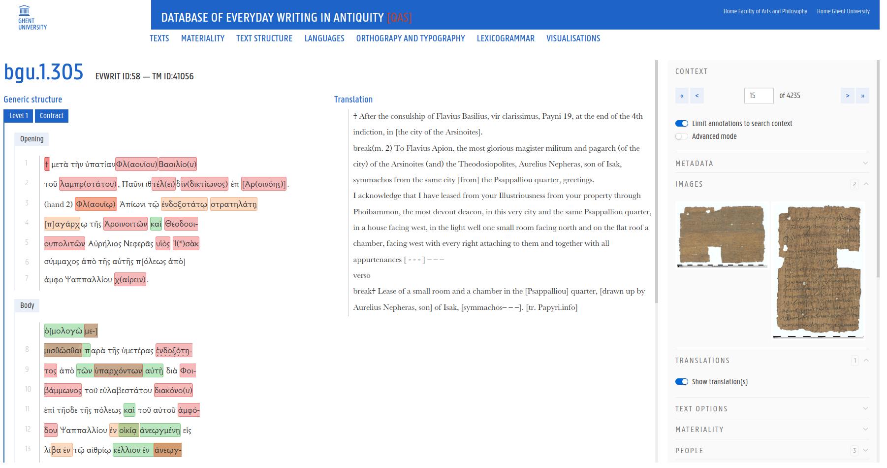

# Evwrit

This repository contains the source code of the [Everyday Writing](https://www.evwrit.ugent.be/) database.



The Evwrit database consists of a Symphony back-end connected to a PostgreSQL database and Elasticsearch search engine.
The search and edit pages consist of Vue.js applications.

## Getting Started

Read the [Important Notes](#important-notes) thoroughly before starting!

First, create a `./app/.env.dev` file based on the `example.env` file. Update the variables in the `.env.dev` file to the desired values. Additionally, update the PGAdmin variables in `pgadmin.env` to the desired login credentials.

```sh
cp example.env ./app/.env.dev
```

Next, make sure ssh-agent is running on your machine and exposes the correct key. To add a key run `ssh-add ~/.ssh/id_rsa`. To check the keys exposed by ssh-agent, run `ssh-add -l`.

```sh
ssh-add ~/.ssh/id_rsa
```

Finally, run the following command to run the docker services:

- PHP Symfony
- Elasticsearch
- DBBE postgres database
- Node.js
- pgAdmin

```sh
docker compose -f docker-compose.dev.yaml up --build 
```

After the containers are up and running, you can access the Evwrit database on [localhost:8080](http://localhost:8080).

## Database

In the `initdb` folder, you can find the necessary scripts to create the database schema and a minimum test dataset. The
sql scripts are run when when the database container is first created.

You can add additional scripts to the `initdb` folder if required.

## Indexing

During the first run, the startup script will create (if needed) initial indexes for the Elasticsearch search engine (
100 records max).

To index more records, run the following command:

```sh
docker exec -it evwrit-dev-symfony-1 php bin/console app:elasticsearch:index text [max limit]
docker exec -it evwrit-dev-symfony-1 php bin/console app:elasticsearch:index level [max limit]
```

## Docker production build

Add the correct SSH key to the agent if building in production, and then run:

```sh
# For production build
docker buildx build --tag evwrit-web --target prod --ssh default .
```

#### Notes:

- Ensure you have the ssh-agent active with the correct SSH key!
- If an external PostgreSQL database or Elasticsearch is used, update or remove the services in `docker-compose.yaml` (
  or create a `docker-composer.override.yaml` file).

## IMPORTANT NOTES

- This application uses the Ghent University Theme. The stylesheets and code is stored on a private repository. To build
  this application, you need access to the theme repository with a private key.

- Ensure that your ssh agent is running and that your key(s) are added before building or starting the containers. For
  production builds, it is necessary to start and add your SSH key in the same terminal window (unless set up via config
  file) as where the build command is executed.

- The SQL scripts in `initdb` should be named in the correct order. A good example is naming the first script
  `001-<first file>.sql`, the next script `010-<second file>.sql`, and the last script `100-<third file>.sql`.

- When running in development, three folders will be created locally: `node_modules`, `vendor`, and `var` (for
  PostgreSQL and Elasticsearch data). If you want to run in production after development, be sure to delete these three
  folders!
